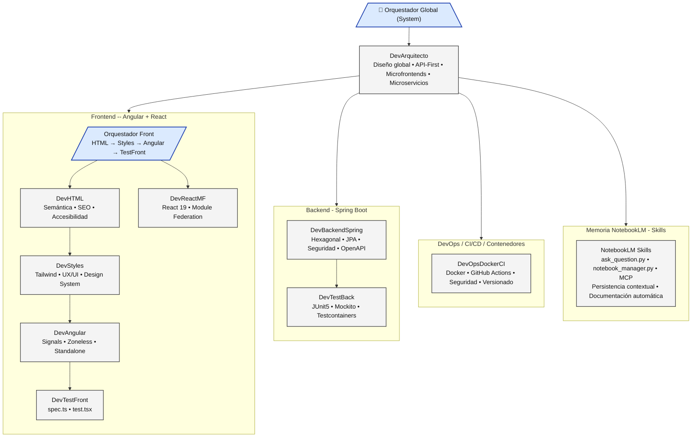

```mermaid
flowchart TB

    %% ========= ORQUESTADOR GLOBAL =========
    ORQ[/"🧠 Orquestador Global (System)"\]:::orch
    ARQ["DevArquitecto<br/>Diseño global • API‑First • Microfrontends • Microservicios"]:::agent

    ORQ --> ARQ

    %% ========= FRONTEND =========
    subgraph FRONTEND ["Frontend -- Angular + React"]
        direction TB

        ORQF[/"Orquestador Front<br/>HTML → Styles → Angular → TestFront"/]:::orch

        DEVHTML["DevHTML<br/>Semántica • SEO • Accesibilidad"]:::agent
        DEVSTYLES["DevStyles<br/>Tailwind • UX/UI • Design System"]:::agent
        DEVANG["DevAngular<br/>Signals • Zoneless • Standalone"]:::agent
        DEVTESTF["DevTestFront<br/>spec.ts • test.tsx"]:::agent
        DEVREACT["DevReactMF<br/>React 19 • Module Federation"]:::agent

        ORQF --> DEVHTML --> DEVSTYLES --> DEVANG --> DEVTESTF
        ORQF --> DEVREACT
    end

    %% ========= BACKEND =========
    subgraph BACKEND ["Backend - Spring Boot"]
        direction TB

        DEVBKS["DevBackendSpring<br/>Hexagonal • JPA • Seguridad • OpenAPI"]:::agent
        DEVTESTB["DevTestBack<br/>JUnit5 • Mockito • Testcontainers"]:::agent

        DEVBKS --> DEVTESTB
    end

    %% ========= DEVOPS =========
    subgraph DEVOPS [DevOps / CI/CD / Contenedores]
        direction TB

        DEVOPSAG["DevOpsDockerCI<br/>Docker • GitHub Actions • Seguridad • Versionado"]:::agent
    end

    %% ========= NOTEBOOKLM =========
    subgraph NB ["Memoria NotebookLM - Skills"]
        direction TB

        NOTEBOOK["NotebookLM Skills<br/>ask_question.py • notebook_manager.py • MCP<br/>Persistencia contextual • Documentación automática"]:::agent
    end

    %% Relaciones desde Arquitecto
    ARQ --> FRONTEND
    ARQ --> BACKEND
    ARQ --> DEVOPS
    ARQ --> NB

    %% ========= THEMES =========
    classDef orch fill:#dbeafe,stroke:#1e40af,stroke-width:2px,color:#111,border-radius:6px;
    classDef agent fill:#f4f4f4,stroke:#444,stroke-width:1.5px,color:#111,border-radius:6px;
```